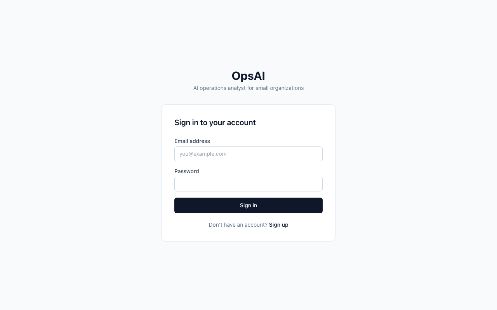
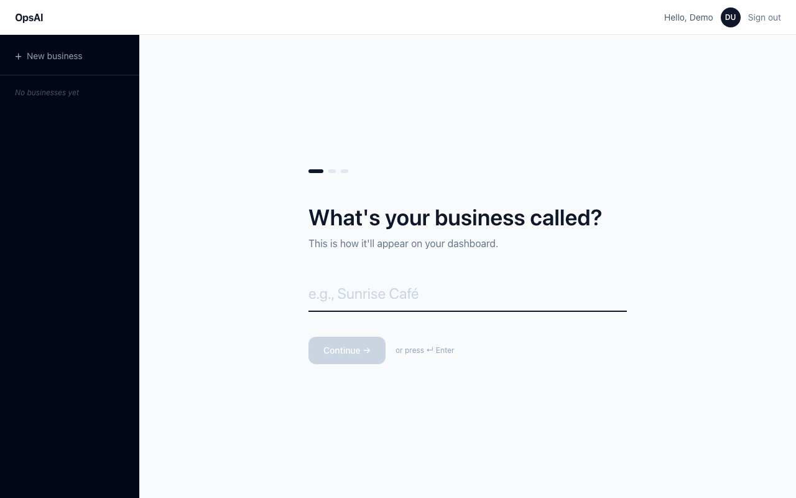
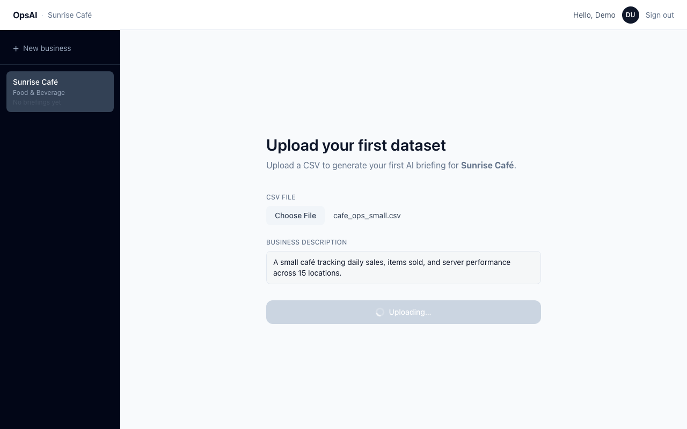
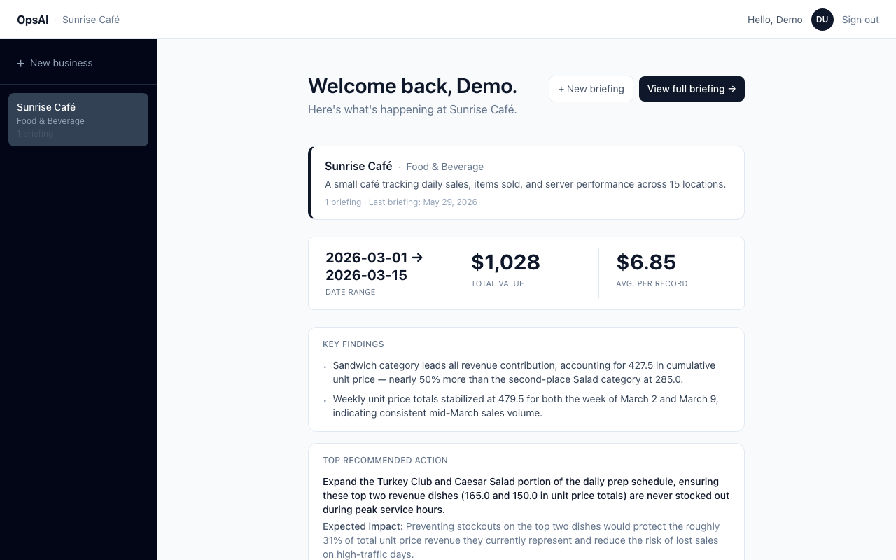
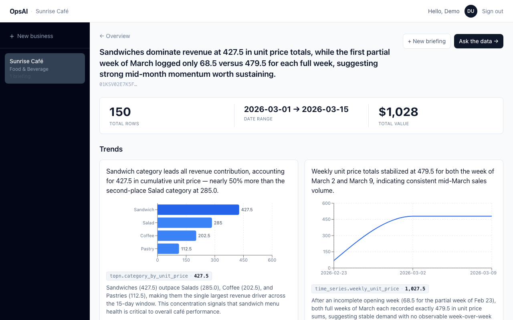
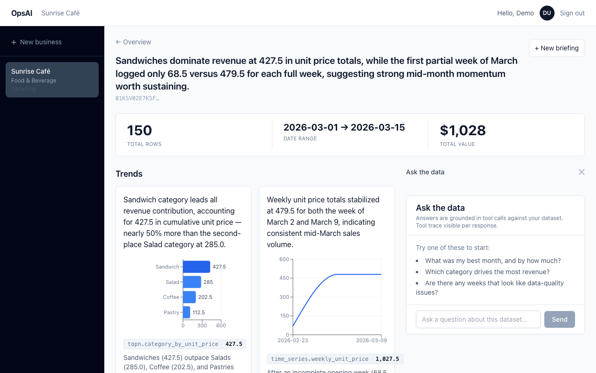

# OpsAI

An AI operations analyst for small organizations. Upload a CSV and a one-sentence description of your business — OpsAI returns a one-page briefing with trends, anomalies, and recommended actions, each grounded in a computed statistic.

Built as a CS153 project at Stanford.

---

## What it does

1. **Upload a CSV** — sales records, donations, server logs, anything tabular
2. **Get a briefing in ~45 seconds** — headline finding, trends, anomalies, and concrete recommended actions
3. **Every claim cites a number** — no hallucinated stats; all figures come from DuckDB queries, the LLM only writes prose around them
4. **Ask follow-up questions** — a chat panel lets you query the dataset with natural language backed by a tool-use loop

---

## Screenshots

### Login


### Onboarding — one field per screen, Enter to advance


### Upload your dataset


### Generating — spinner + animated step indicator


### Home dashboard — KPI strip, key findings, top recommended action


### Full briefing — headline, trends with charts, grounded recommendations


### Chat — tool-use loop with 4 read-only tools


---

## How it works

### The core rule: LLM never computes numbers

All statistics are computed deterministically in Python using DuckDB queries. The LLM receives the computed results and writes prose around them. Every trend and recommendation in a briefing must cite a `stat_ref` pointing to an entry in the stats payload — if the reference doesn't exist, the briefing fails validation and retries. The briefing is grounded by construction, not by prompt instruction.

### Data flow

```
POST /datasets
  CSV → parquet (pandas + pyarrow)
  schema.json  ← column names, dtypes, null rates, sample values
  profile.json ← one LLM call: domain name, key columns, metrics of interest, seasonality hints

POST /datasets/{id}/briefings
  stats selector → picks which of 7 stat templates to run (driven by profile key columns)
  DuckDB queries → stats_payload (summary, time series, top-N, category distribution, anomaly z-score)
  LLM call      → briefing JSON (headline + trends + anomalies + actions, all citing stat_refs)
  Pydantic validation + retry once on failure
  saved as data/briefings/{ulid}.json

POST /datasets/{id}/chat
  message + history → tool-use loop (up to 7 iterations)
  4 read-only tools: list_columns, get_profile, compute_stat, run_sql
  returns {answer, trace}
```

### Stats engine — 7 templates

| Template | What it computes |
|---|---|
| `summary` | Row count, date range, total and mean for the amount column |
| `null_rates` | Null % per column |
| `time_series` | Aggregated amount by week, month, or day |
| `period_over_period` | % change between the two most recent periods |
| `topn` | Top N entities/categories by total amount |
| `category_distribution` | Count and share per category |
| `anomaly_zscore` | Records > 2 standard deviations from the rolling mean |

### Chat tool-use loop

The backend receives the current message and full conversation history, assembles an Anthropic messages list, and loops until Claude stops using tools or hits the 7-iteration cap. All tools are read-only.

| Tool | Purpose |
|---|---|
| `list_columns` | Returns schema — column names, dtypes, nullable, sample values |
| `get_profile` | Returns the domain profile (entity grain, metrics of interest, glossary) |
| `compute_stat` | Runs one of the 7 stat templates with given params |
| `run_sql` | Executes a read-only `SELECT` (max 5,000 rows) |

### Domain profile — no hard-coded industries

On upload, a single LLM call generates a `profile.json` from the schema and user description. This profile — domain name, entity grain, key columns, metrics of interest, seasonality hints, glossary — is passed into every downstream prompt. The same pipeline runs for a café, an NGO, or a restaurant without any code changes.

---

## Tech stack

| Layer | Choice |
|---|---|
| Backend | FastAPI (Python), synchronous endpoints |
| LLM | Anthropic SDK, Claude Sonnet 4.6, native tool use |
| Analytics | DuckDB (SQL over parquet), pandas |
| Storage | SQLite for user/report index; parquet + JSON on disk for datasets and briefings |
| Auth | JWT (24h expiry) + bcrypt password hashing |
| Frontend | React 19, Vite, TypeScript |
| Styling | Tailwind CSS, shadcn/ui |
| Charts | Recharts (bar, line, pie) |
| IDs | ULIDs (sortable, URL-safe) |

No LangChain. No vector DB. No Postgres. No Docker. No streaming. All requests are synchronous — if generation takes 45 seconds, the frontend shows a spinner with an animated step indicator.

---

## Running locally

**Prerequisites:** Python 3.9+, Node 20+, an Anthropic API key

**Backend (port 8000):**
```bash
cd backend
python3 -m venv .venv
.venv/bin/pip install -e .
cp .env.example .env          # add your ANTHROPIC_API_KEY
.venv/bin/python -m uvicorn app.main:app --port 8000
```

**Frontend (port 5173):**
```bash
cd frontend
npm install
npm run dev
```

**Health check:**
```bash
curl http://127.0.0.1:8000/health   # → {"ok":true}
```

Open `http://localhost:5173`, sign up, and upload a CSV to try it.

**Sample CSVs** are in `samples/`:
- `cafe_ops_small.csv` — 150 rows, 15 days of café sales (~45s to brief, best for quick testing)
- `ngo.csv` — donor records for an NGO
- `restaurant.csv` — synthetic restaurant data with planted anomalies

> Always use `.venv/bin/python`, not the system `python` or `python3`. The `data/` directory (datasets, briefings, SQLite DB) is gitignored and created automatically on first run.

---

## Eval runner

```bash
cd backend
.venv/bin/python -m eval.run
```

Runs the full pipeline over three JSON fixtures (café, NGO, restaurant) and checks:

- Schema validity — Pydantic validation passed
- Minimum item counts — at least 2 trends and 2 actions
- All `stat_ref`s resolve — no briefing claim points to a non-existent stat
- Domain keyword in headline — "coffee", "clinic", "revenue"

Current status: **18/18 checks passing** (~43–52s per fixture).

---

## Project structure

```
backend/
  app/
    routes/          # auth, businesses, datasets, briefings, chat
    agent/           # prompts.py (all LLM prompts), profile.py, llm.py
    services/        # ingest, stats, stats_selector, briefing, chat
    tools/           # schema + registry for the 4 chat tools
    storage/         # canonical disk paths (datasets/, briefings/)
    db.py            # SQLite init (users, businesses, reports tables)
    models.py        # Pydantic models for briefing JSON schema
  eval/
    run.py           # eval runner: python -m eval.run
    fixtures/        # cafe_ops.json, ngo.json, restaurant.json
  samples/           # demo CSVs

frontend/
  src/
    pages/           # Login, OnboardingScreen, AppShell, HomeScreen
    components/      # NavBar, BusinessSidebar, ChatPanel, KpiStrip, charts/
    lib/             # api.ts (all fetch calls), auth.ts (JWT helpers)
    types.ts         # TypeScript types: Business, BriefingBundle, ReportSummary
```

---

## Key design decisions

**Generic engine, no hard-coded domains.** Profile generation runs on upload; every downstream prompt reads from `profile.json`. Adding a new industry requires no code changes.

**Single retry on validation failure.** If the LLM returns invalid JSON or a briefing that fails Pydantic validation, the pipeline retries once with the error appended to the prompt. Two failures returns a 502.

**Chat history is in-memory only.** The frontend holds conversation history and sends it with each message. Nothing is persisted to disk.

**One model, no fallback.** Claude Sonnet 4.6 for every LLM call. No model routing, no fallback.

**No streaming.** The briefing is generated as a single JSON object, validated, and rendered when complete. The ~45s wait is intentional — correctness over speed.
