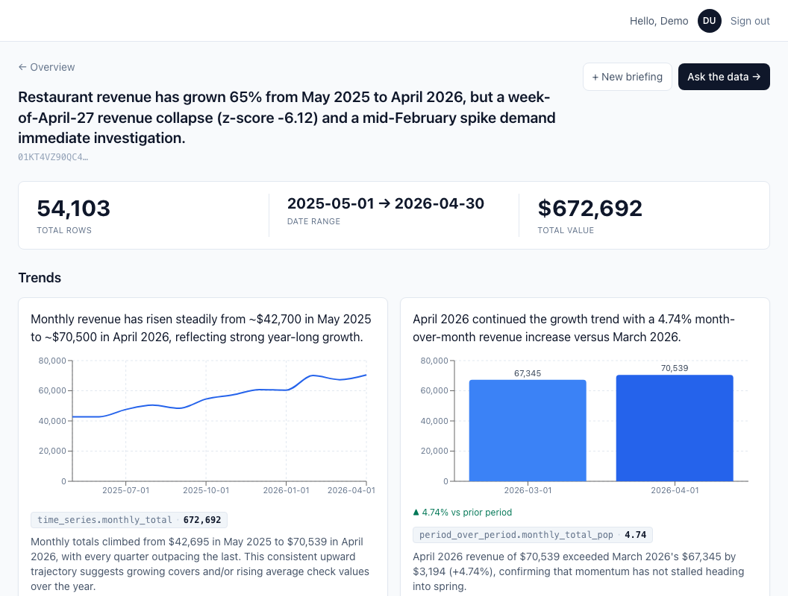
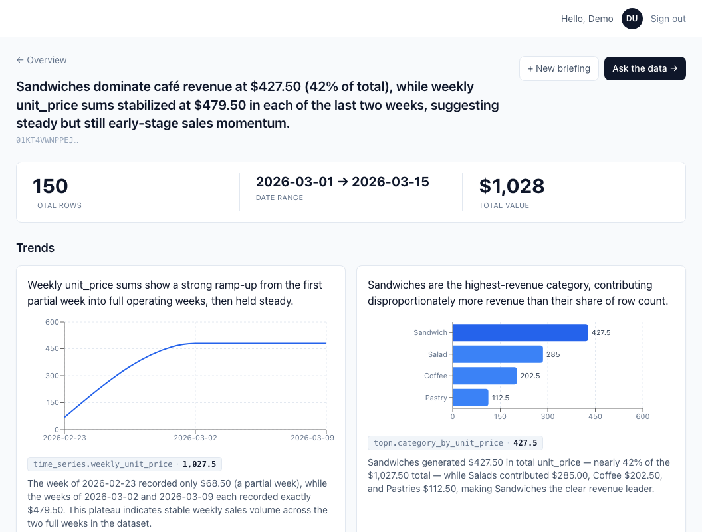
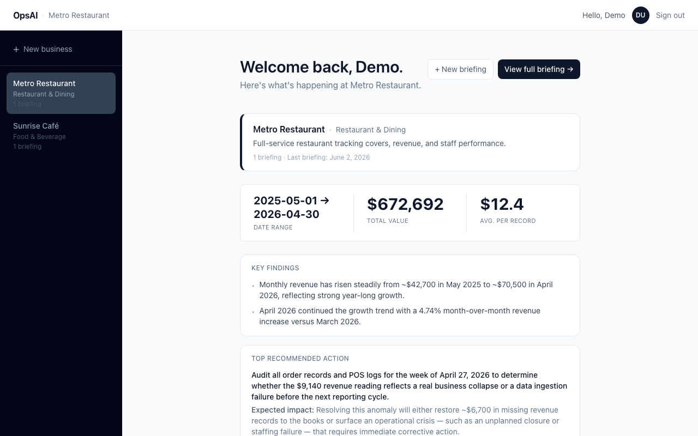
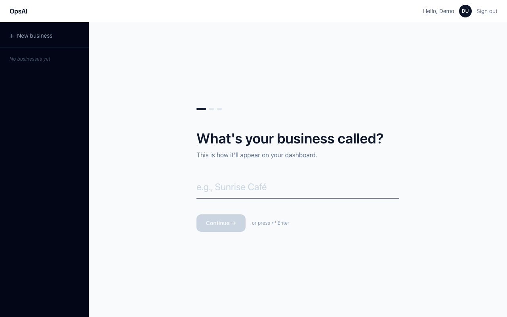
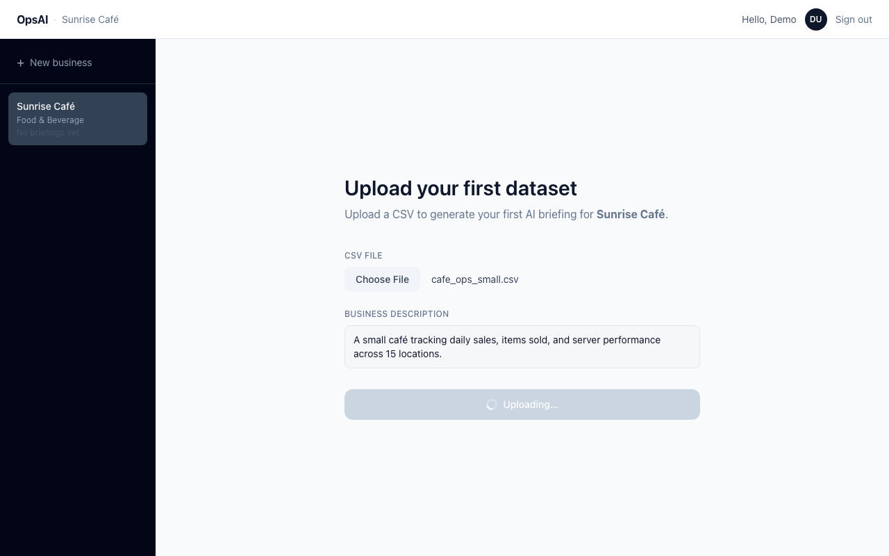
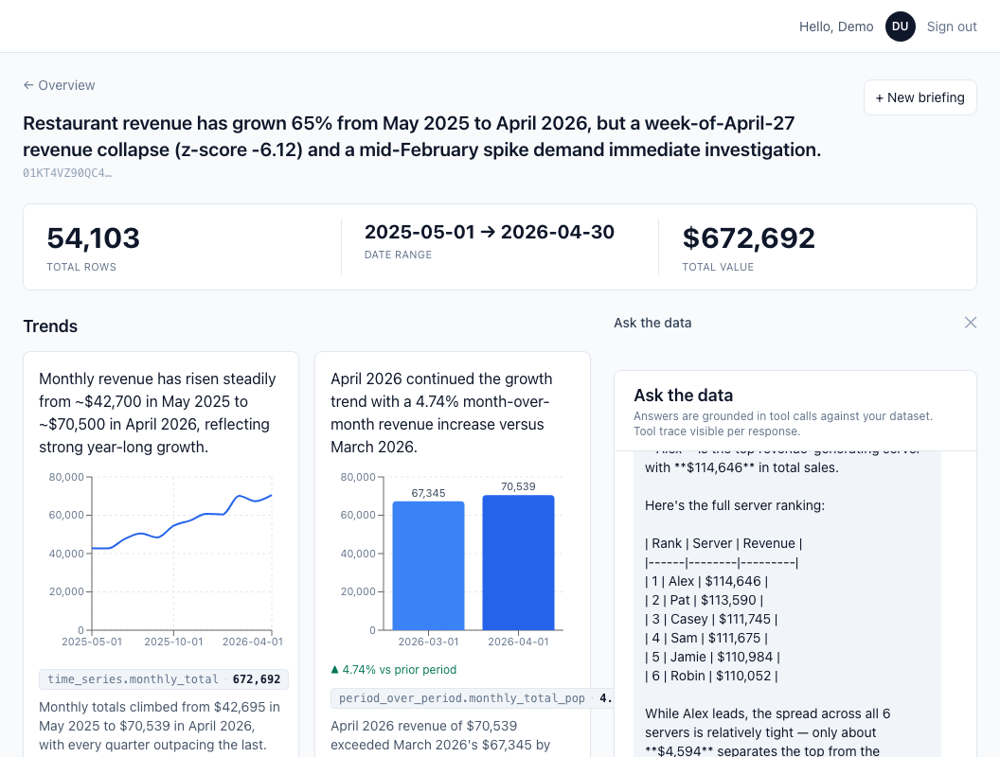

# OpsAI

Upload a CSV and a one-sentence description of your business. Get back a one-page briefing — headline finding, trends, anomalies, and recommended actions — in about 45 seconds. Every claim cites the number it came from.

Built as a CS153 project at Stanford.

---

## AI use disclosure

AI tools were used in two distinct ways in this project:

**1. Claude Sonnet 4.6 (Anthropic) — the core engine of the app itself**

The application makes three types of LLM calls at runtime:
- **Domain profiling:** on CSV upload, one call generates a `profile.json` (domain name, entity grain, key columns, metrics of interest, glossary) from the schema and user description. This profile is passed into every downstream prompt.
- **Briefing generation:** one call receives the computed stats payload and writes the headline, trends, anomalies, and recommended actions. The LLM never computes numbers — all figures come from DuckDB queries; the model only writes prose around them.
- **Chat tool-use loop:** the chat panel runs Claude with four read-only tools (`list_columns`, `get_profile`, `compute_stat`, `run_sql`) in a loop of up to 7 iterations per question.

**2. Claude Code — used to build the project**

Claude Code (Anthropic's AI coding assistant) was used as a development tool throughout the project: scaffolding the FastAPI backend, building the React frontend, writing the DuckDB stat templates, designing the Pydantic validation schema, and iterating on the briefing and profile prompts. All code was reviewed and the architecture, design decisions, and product direction were made by me.

---

## The briefing

The system detects a 65% revenue growth trend *and* flags a z-score -6.12 revenue collapse in the same headline:



Each card shows a chart, a stat badge (the exact computed value), and a prose explanation grounded in that number. The LLM writes the prose — DuckDB computes the numbers. They can't be mixed up by construction: every trend and recommendation must cite a `stat_ref` that resolves to an entry in the stats payload, or the briefing fails validation and retries.

---

## Works across any domain

The engine has no hard-coded industries. On upload, one LLM call generates a domain profile (key columns, metrics of interest, entity grain, glossary). Everything downstream — stat selection, briefing generation, chat — reads from that profile.

**Food & Beverage** — 150 rows, 15 days of café sales:


**Restaurant & Dining** — 54,103 rows, 12 months with a planted anomaly:
*(same screenshot above)*

Same pipeline, different profiles, completely different charts and language.

---

## Multiple businesses, one account

The sidebar lists all your businesses. Clicking switches the entire view — dashboard, briefings, chat context — to that business. The "+ New business" button opens a modal; hover a sidebar entry to reveal the delete button.



---

## Onboarding

New users get a three-step wizard — one field per screen, Enter to advance:



---

## Loading state

During the ~45s generation, a spinner and cycling step indicator show what's happening:



---

## Chat — ask the data

A right-panel chat interface runs a tool-use loop (up to 7 iterations) against the live dataset. Four read-only tools: `list_columns`, `get_profile`, `compute_stat`, `run_sql`. The response includes the tool trace so you can see exactly what was queried.



---

## How it works

### Core rule: the LLM never computes numbers

All statistics come from DuckDB queries in `services/stats.py`. The LLM receives the results and writes prose around them. Every trend and recommendation must include a `stat_ref` key that exists in the computed payload — if it doesn't, the briefing fails Pydantic validation and retries once with the error message appended.

### Pipeline

```
POST /datasets
  CSV → parquet + schema.json (column names, dtypes, null rates, samples)
  One LLM call → profile.json (domain name, key columns, metrics, glossary)

POST /datasets/{id}/briefings
  Stats selector → picks which of 7 templates to run (driven by profile key columns)
  DuckDB queries → stats_payload (no LLM involved)
  One LLM call  → briefing JSON validated against Pydantic schema
  Retry once on validation failure → save to disk

POST /datasets/{id}/chat
  Message + history → tool-use loop (max 7 iterations, 4 read-only tools)
```

### 7 stat templates

| Template | What it computes |
|---|---|
| `summary` | Row count, date range, total and mean for the amount column |
| `time_series` | Amount aggregated by week, month, or day |
| `period_over_period` | % change between the two most recent periods |
| `topn` | Top N entities by total amount |
| `category_distribution` | Count and share per category |
| `anomaly_zscore` | Rows > 2 standard deviations from the rolling mean |
| `null_rates` | Null % per column |

---

## Tech stack

| Layer | Choice |
|---|---|
| Backend | FastAPI, Python, synchronous |
| LLM | Anthropic SDK, Claude Sonnet 4.6, native tool use |
| Analytics | DuckDB (SQL over parquet), pandas |
| Storage | SQLite for user/report index; parquet + JSON on disk |
| Auth | JWT (24h) + bcrypt |
| Frontend | React 19, Vite, TypeScript |
| Styling | Tailwind CSS, shadcn/ui |
| Charts | Recharts (line, bar, pie) |

No LangChain. No vector DB. No Postgres. No Docker. Localhost only.

---

## Running locally

```bash
# Backend (port 8000)
cd backend
python3 -m venv .venv && .venv/bin/pip install -e .
cp .env.example .env        # add ANTHROPIC_API_KEY
.venv/bin/python -m uvicorn app.main:app --port 8000

# Frontend (port 5173)
cd frontend && npm install && npm run dev
```

Sample CSVs are in `samples/`. Start with `cafe_ops_small.csv` (150 rows, briefing in ~45s).

> Always use `.venv/bin/python` — the system Python doesn't have the dependencies.

---

## Eval

```bash
cd backend && .venv/bin/python -m eval.run
```

Runs the full pipeline over three fixtures (café, NGO, restaurant). Checks schema validity, minimum item counts, all `stat_ref`s resolve, and domain keyword in headline. **18/18 passing** (~43–52s per fixture).
